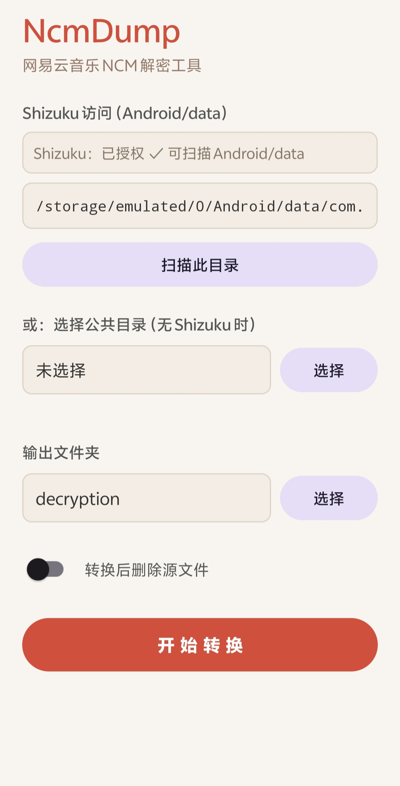

# NcmDump for Android

网易云音乐 NCM 文件解密工具 — Android 原生版

前辈们已经做了许多优秀的 NCM 解密工具，也有部分方案能够运行在 Android 平台上。不过其中不少更偏向桌面端逻辑的移植或封装，在 Android 实际使用场景下仍有一些不够顺手的地方，例如需要反复输入目录、手动搬运 Android/data 中的文件等。因此我尝试做一个更偏 Android 原生体验的实现，把目录访问、批量解密、标签写入等流程尽量整合到同一个 app 内完成。

本项目可以将加密的 `.ncm` 文件在 Android 平台上转换为标准 **MP3** / **FLAC**，完整保留歌曲元数据（歌名、歌手、专辑）和封面图。纯 Kotlin 实现，无 JNI / FFmpeg 依赖。解密、标签、封面全部在本地完成。

---

> **写在前面**：我的本职并非软件开发。本项目主要通过 [Claude Code](https://claude.com/claude-code) 辅助构建——我负责需求设计、Android 真机验证与交互流程调整，具体代码实现则大量借助 AI 完成。因此项目中仍可能存在设计、健壮性或安全性方面的问题，**非常欢迎有经验的开发者审阅、指正乃至接手维护**（详见文末 [参与与联系](#参与与联系)）。

## 功能

- **批量解密** — 选择来源与输出文件夹，一键批量转换
- **Shizuku 访问 `Android/data`** — 免 root 读取被分区存储封锁的应用私有目录（Android 11+ 的痛点）
- **SAF 兼容** — 没有 Shizuku 时，自动回退到系统文件选择器，照常处理公共目录里的 `.ncm`
- **元数据保留** — 自动写入 ID3v2.3 (MP3) / VorbisComment (FLAC)，UTF-16 编码正确显示中日韩文字
- **封面保留** — 内嵌封面图写入音频文件
- **无损 FLAC** — 仅重写 metadata block 链，音频帧保持逐字节透传，不发生重新编码
- **可选删除源文件** — 转换后可自动清理原始 `.ncm`
- **目录记忆** — 自动保留上次填写的输入和输出目录，不用重复填写

## 下载

请前往 Releases 页面下载 APK：

[Releases](../../releases)

## 截图




## 为什么需要 Shizuku？

从 Android 11 起，分区存储（Scoped Storage）封锁了 `/Android/data/` 和 `/Android/obb/`：

- 普通文件 API 读不到，**`MANAGE_EXTERNAL_STORAGE`（所有文件访问）也无法正确识别**；
- SAF 文档选择器自 Android 11 起**禁止授权 `Android/data` 子目录**（`ExternalStorageProvider.shouldBlockFromTree`）。

网易云恰好把下载的 `.ncm` 存在这里。本项目用 **[Shizuku](https://shizuku.rikka.app/)** 把文件访问提权到 shell uid（adb 级别），通过一个运行在 shell 进程里的 `UserService` 直接读取这些目录——免 root，也不必把文件手动拷贝出来。

> 如果你的 `.ncm` 文件本来就在公共目录（如 `Download/`、`Music/`），**不装 Shizuku 也能用**，走 SAF 模式即可。

## 构建

### 环境要求

- Android Studio Hedgehog (2023.1) 或更新
- JDK 17
- Android SDK 34

### 步骤

```bash
git clone https://github.com/Merrrrrrrrr/NcmDump-for-Android.git
cd NcmDump-for-Android
```

用 Android Studio 打开，Sync Gradle 后 `Build > Build APK`；或命令行：

```bash
./gradlew assembleDebug      # macOS / Linux
gradlew.bat assembleDebug    # Windows
```

APK 输出：`app/build/outputs/apk/debug/app-debug.apk`

## 使用

### 方式一：Shizuku（读取 `Android/data`，推荐）

1. 安装并启动 [Shizuku](https://shizuku.rikka.app/)（无线调试或 root 方式均可）。
2. 打开 NcmDump，顶部状态显示 **「已运行，待授权」**，点 **「授权 Shizuku」** 并允许。
3. 路径框已预填荣耀特供版网易云音乐目录，按需修改为你的 `.ncm` 所在路径，例如：
   - 网易云音乐：`/storage/emulated/0/Android/data/com.netease.cloudmusic/files/Documents/Music`
   - 荣耀特供版网易云音乐：`/storage/emulated/0/Android/data/com.hihonor.cloudmusic/files/Documents/Music`

   > 不确定具体路径时，可用 `adb shell ls "<路径>"` 先确认。
4. 点 **「扫描此目录」**，下方显示找到的 NCM 文件数。
5. 选择 **输出文件夹**（公共目录即可），点 **「开始转换」**。

### 方式二：SAF（无 Shizuku，仅公共目录）

1. 在 **「或：选择公共目录」** 处点 **「选择」**，选中包含 `.ncm` 的文件夹。
2. 选择 **输出文件夹**，点 **「开始转换」**。

## 项目结构

```
NcmDump/
├── app/src/main/
│   ├── aidl/com/ncmdump/app/
│   │   └── IFileService.aidl          # Shizuku 文件服务的 binder 接口
│   ├── java/com/ncmdump/app/
│   │   ├── crypto/
│   │   │   ├── AesEcb.kt              # AES-128-ECB 解密
│   │   │   └── Base64.kt             # Base64 解码
│   │   ├── ncm/
│   │   │   ├── NcmDecryptor.kt       # NCM 解密核心引擎
│   │   │   ├── TagWriter.kt          # ID3v2.3 / FLAC 标签构建
│   │   │   └── FlacTagInjectingStream.kt  # FLAC metadata 流式注入
│   │   ├── shizuku/
│   │   │   ├── FileService.kt        # 运行在 shell 进程的文件服务（读 Android/data）
│   │   │   └── ShizukuManager.kt     # Shizuku 可用性/授权/绑定生命周期
│   │   ├── source/
│   │   │   └── NcmFileSource.kt      # 来源抽象：ShizukuNcmSource / SafNcmSource
│   │   ├── MainActivity.kt           # UI 层
│   │   ├── MainViewModel.kt          # 业务逻辑
│   │   └── PreferencesManager.kt     # SharedPreferences 持久化
│   └── res/                          # 布局与资源
├── build.gradle.kts
└── settings.gradle.kts
```

## 架构要点

- **来源抽象（`NcmFileSource`）**：`ShizukuNcmSource`（基于路径，经 `ParcelFileDescriptor` 读流）与 `SafNcmSource`（基于 `DocumentFile`）实现同一接口，上层逻辑无感知。
- **输出始终走 SAF `DocumentFile`**：写入公共目录并能被 MediaStore 收录。
- **解密管线零改动**：`NcmDecryptor` 只消费一个前向 `InputStream`，两种来源给的都是普通 `InputStream`，所以解密/标签代码完全复用。

## 参与与联系

如开头所述，本项目由 AI 辅助完成。**非常欢迎真正有经验的开发者参与**——无论是指出问题、重构代码，还是直接接手维护。

以下是我最没有把握、最希望被审阅的部分，欢迎重点关注：

- **加解密的正确性与安全**：`crypto/`、`ncm/NcmDecryptor.kt` 的实现是否健壮，有无边界或内存问题；
- **Shizuku 生命周期与安全**：`shizuku/` 的服务绑定/解绑、binder 失效恢复、权限处理是否规范；
- **大文件与异常处理**：流式处理在超大 FLAC、磁盘写满、中途取消等情况下的表现；
- **资源与并发**：协程作用域、`InputStream` / `ParcelFileDescriptor` 是否都被正确关闭。

联系方式：

1. **提 [Issue](../../issues)** — 反馈 bug 或建议，公开可检索。
2. **发 [Pull Request](../../pulls)** — 直接贡献代码；由于我并非专业 Android 开发者，复杂改动可能需要更多时间理解和验证。若能在 PR 描述中用相对直白的语言说明「**改了什么、为什么这样改**」，会非常有助于我完成测试与合并。
3. **邮件**：2181451507@qq.com — 适合不便公开讨论的内容。

> 坦白说，我对 PR 的技术评审能力有限，回复可能较慢，敬请见谅。一份清晰的说明能极大提高沟通效率，也更容易让你的贡献被接受。🙏

## 致谢

解密算法基于 [taurusxin/ncmdump](https://github.com/taurusxin/ncmdump) 的 C++ 实现，纯 Kotlin 重写。`Android/data` 访问基于 [Shizuku](https://github.com/RikkaApps/Shizuku)。最早的C++版本为 [anonymous5l](https://github.com/anonymous5l/) 实现的，原作者已经删库。

## 免责声明与使用须知

本项目**源代码**以 MIT 协议开源，你可以自由使用、修改和分发（包括商业用途），详见 [License](#license)。

以下须知针对**本工具的使用方式与解密产物**，属于道德与法律层面的提醒，并非源代码许可的一部分：

- 本工具仅供个人学习、研究与技术交流，请勿用于任何侵犯版权的商业行为
- 请勿传播解密后的音频文件，尊重版权
- 使用者应自行确保对转换的文件拥有合法使用权
- 开发者不对任何滥用行为承担责任

## License

MIT License — 详见 [LICENSE](LICENSE)
